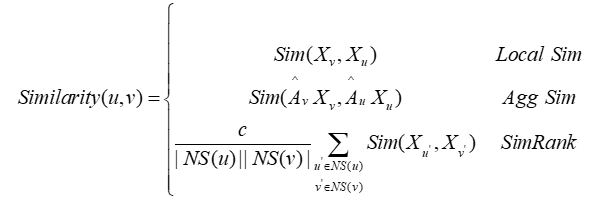

# 基于因果元路径优化的异构图神经网络节点分类系统
## 一、项目背景与目的
随着异构图神经网络（HGNN）的广泛应用，尤其是在学术网络、推荐系统等领域中，多模态信息的融合和复杂结构的处理成为研究热点。本项目是在课程学习期间完成的系统原型，旨在实现一个支持路径搜索与模型训练一体化的异构图节点分类平台，并结合所学的 深度学习、图神经网络、因果推断技术进行系统设计和实现。

本软件采用 FastAPI 构建后端接口，结合 Gumbel Softmax、注意力机制、自适应结构搜索等方法，实现了高效的异构图路径筛选与节点分类建模。

## 二、项目意义与解决的问题
实际问题：
异构图中包含多种类型的节点和边，在进行节点分类任务时，如何选择合适的元路径组合及模型结构，对性能具有决定性影响。传统方法依赖人工设计，效率低下、适应性差。

本项目的贡献：
通过自动化路径搜索（Search 模块），智能选取有信息价值的因果元路径。

在模型训练阶段（Study 模块），结合 Gumbel-Softmax 搜索与残差融合机制，提升模型的表达能力。

提供标准化 FastAPI 接口，支持高效部署与在线调用。

## 三、现有方法分类及本项目归属
| 方法类型 | 描述|代表方法 |
|---------|---------|---------|
|手工设计元路径|人工设定语义路径组合，灵活性差|metapath2vec, HAN|
|注意力机制选择|使用注意力分配元路径权重，但不具备结构搜索能力|MAGNN, SeHGNN|
|结构搜索方法|使用搜索机制自动选择路径与结构，性能最优|本项目（CMS_Se）

📌 本项目属于 结构搜索方法，强调因果性选择+Gumbel采样优化。

## 四、本文方法
本项目计划从因果视角切入，优先选择与预测结果存在因果关联的少数长距离元路径，从而有效利用异质图中的复杂语义信息。同时，提出一种新的不变学习框架，通过挖掘节点的固有特征信息推断潜在环境，并将与预测任务无关的虚假特征从特征聚合过程中分离开来，以此缓解分布偏移问题，提升模型的泛化能力。

### 4.1长距离元路径搜索
由于指数级增长的元路径极大地挑战了元路径搜索的效率和效果，我们拟使用一种渐进采样算法和因果采样评估策略，分别解决这两个问题。
设P为初始搜索空间，包含所有与目标节点相关的K条元路径， 是属于节点类型 的所有节点的原始特征矩阵， 是节点类型 和 之间的行归一化邻接矩阵。邻居聚合模块基于 SeHGNN，通过对异质图进行预处理，将其转换为目标节点的规则形张量。具体来说，它使用邻接矩阵的乘法来计算每个基于元路径的邻居对目标节点的最终贡献权重。则跳数为 的元路径 的邻居聚合过程如下：

为实现无需先验知识的自动化元路径搜索，本研究中拟将搜索空间扩展为所有与目标节点相关的元路径集合，这对搜索效率和效果提出了巨大挑战。为了解决效率问题，我们拟采用渐进采样算法，在每次迭代中对元路径进行采样，并逐步缩小搜索空间。
具体来说，我们拟为每条元路径分配一个因果效应参数，用于衡量其与预测任务的相关性。设 为 条元路径的因果效应参数，我们通过Gumbel-Softmax[31]对参数 进行操作，计算不同元路径的因果效应：
 

渐进采样算法根据因果效应逐步将搜索空间从 缩小至 ，从而排除与预测结果并无因果关联的元路径。设 是 中第 大的因果效应。在搜索阶段，搜索空间保留所有不小于 的元路径。动态搜索空间可表示为：
 

在搜索阶段的目标是确定前 条元路径，因此我们在每次迭代中从动态搜索空间中采样 条元路径。每次迭代中，仅更新 条被激活的元路径的参数，而其他参数保持不变。因此，搜索成本与 相关，而不是与 相关。前向传播的过程可以表示为：

在完成渐进采样搜索后，搜索空间从 缩小到 。然而，不同的元路径之间可能存在噪声或冗余，当它们的权重独立计算时，排名前 的元路径未必是最优解。基于这一考虑，我们拟设计一种新的采样评估策略用于元路径搜索。
具体来说，利用渐进采样结束时每条元路径的因果效应作为概率，我们拟从压缩后的搜索空间 中采样 条元路径，以评估它们的整体性能。采样评估拟重复进行200次，以选出验证损失最低的元路径集。这样，我们能够选择最佳的元路径集，而不是独立的前 条元路径。该阶段不耗费大量时间，因为评估过程不涉及权重训练。这个采样过程可以表示为：

然后，保留的元路径集被记录。目标网络用于表示学习的前向传播公式可以表述为：
 

在搜索阶段的参数更新涉及到一个双层优化问题，如公式8所示：
 

综上，渐进采样策略能够动态构建紧凑的搜索空间，而因果评估策略则进一步提高了元路径选择的合理性和鲁棒性，从而有效识别出与预测结果因果关联最强的一组元路径。

### 4.2节点环境推断
为在训练阶段为每个目标节点准确估计其所属环境，本研究旨在有选择地聚合邻居节点的因果特征，同时有效剔除无关的虚假特征。首先，我们利用节点特征之间的相似度来估计其邻域模式。现有异质图中基于相似性的指标可通过公式（9）表示为：

通过上述方法，可以通过平均节点与其邻居之间的相似度来获得节点在训练阶段的邻域模式。
需要注意的是，本研究对相似性度量的目标不同于以往的HGNNs方法。传统HGNNs主要利用相似性选择合适的邻居进行特征聚合，而我们旨在通过估算的邻域模式推断节点环境，从而在因果分析视角下削弱或分离虚假特征的影响。
我们拟利用节点的邻域模式 作为辅助工具，在不依赖数据增强的情况下，联合学习节点的环境划分和节点的不变表示。具体来说，通过节点的邻域模式估算值，可以训练一个环境分类器 ，该分类器会将训练节点软分配到 个环境中。其中， 是预定义的环境数量， 是一个两层的MLP， 表示第 个环境的分类概率，满足 且  。基于此，将在所有训练节点上计算的经验风险（Empirical Risk Minimization，ERM）损失定义为 。

对于不变性惩罚学习，理想情况下，GNN 分类器 应在所有环境中达到最优。当环境分类器 将训练节点分配到 个推断环境后，我们拟采用以下准则检查 是否在所有推断环境中已经最优：
（1）单环境最优性检查。以环境 为例，我们可以额外训练一个环境依赖型分类器  ，仅在属于环境 的训练节点上进行训练。如果 取得的损失小于 ，则说明 在该环境中并不最优。
（2）全局最优性检查。为验证 是否在所有环境中同时达到最优，可以进一步训练一组分类器  ，每个分类器分别对应一个独立的环境，这些分类器共享相同的特征提取器 。如果 提取了在推断环境间不稳定的虚假特征，则 会大于  ，进而引入非零的不变性惩罚。这会影响模型的优化方向，使其趋于在所有环境中达到最优。换言之，只要特征提取器能够提取不变特征，GNN 分类器 与其相关的环境依赖型分类器 的预测结果将在不同环境中保持一致。
从环境分类器的优化视角出发，良好的环境划分应最大化虚假特征在环境间的不稳定性。若提取器  捕获了虚假特征，会引发更高的不变性惩罚。因此，通过优化环境划分器 ，我们可以引导模型生成更加鲁棒的环境，逐步逼近最优的因果特征表示。

综上，在训练阶段，本研究拟通过推断节点环境，结合因果分析方法，在训练阶段有效分离虚假特征，显著提升模型的泛化能力和鲁棒性。

部分代码片段：

## 五、数据集

## 六、使用方法
启动命令：
`uvicorn api:app --reload --host 0.0.0.0 --port 8000`

1.路径搜索接口 /search

请求方式：POST

路径：http://127.0.0.1:8000/search

参数格式（JSON）：
{
  "dataset": "IMDB",
  "num_hops": 6,
  "amp": true
}

输出格式：
{
  "best_meta_paths": [
    "MK",
    "MAMK",
    "MDMA",
    "MKMA",
    "MKMD",
    "MAMAM",
    "MAMDM",
    "MDMDM",
    "MDMKM",
    "MKMDM",
    "MKMKM",
    "MAMAMK",
    "MDMAMA",
    "MDMDMD",
    "MDMKMA",
    "MDMKMD",
    "MDMKMK",
    "MKMAMA",
    "MKMAMK",
    "MKMKMA",
    "MAMDMAM",
    "MAMDMDM",
    "MAMKMAM",
    "MAMKMDM",
    "MDMAMAM",
    "MDMDMKM",
    "MDMKMKM",
    "MKMKMAM",
    "MKMKMDM",
    "MKMKMKM"
  ],
  "best_label_paths": []
}

2.模型训练接口 /study

请求方式：POST

路径：http://127.0.0.1:8000/search

参数格式（JSON）：
{
  "dataset": "IMDB",
  "num_hops": 6,
  "n_layers_2": 3,
  "env_layer_number": 2,
  "amp": true,
  "env_type": "node"
}

返回内容：
{
  "micro_mean": 85.67,
  "micro_std": 0.73,
  "macro_mean": 74.21,
  "macro_std": 0.89
}

## 七、运行结果截图
1.search接口：

2.study接口：

## 八、总结
本项目结合图神经网络、因果推断和结构搜索，提出了一种可扩展、可调度的异构图节点分类系统，并通过 FastAPI 接口进行封装，满足系统化部署和高效复现的需求。项目适合用于科研实验平台搭建、图数据挖掘系统原型开发等任务。